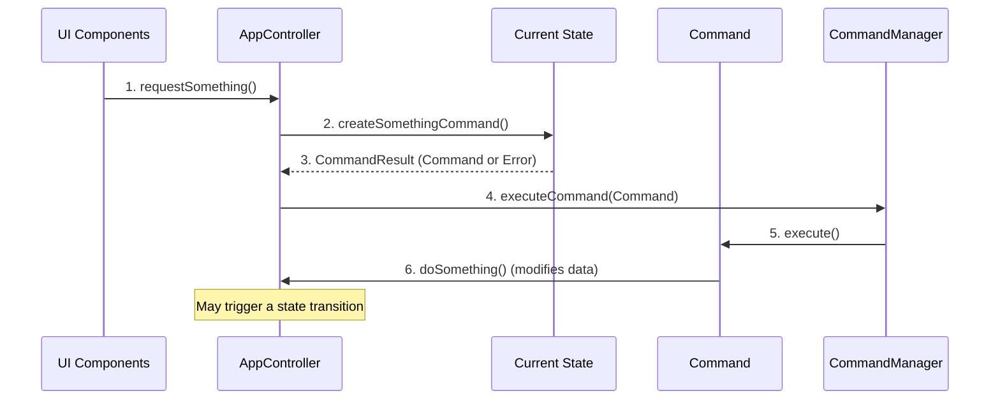
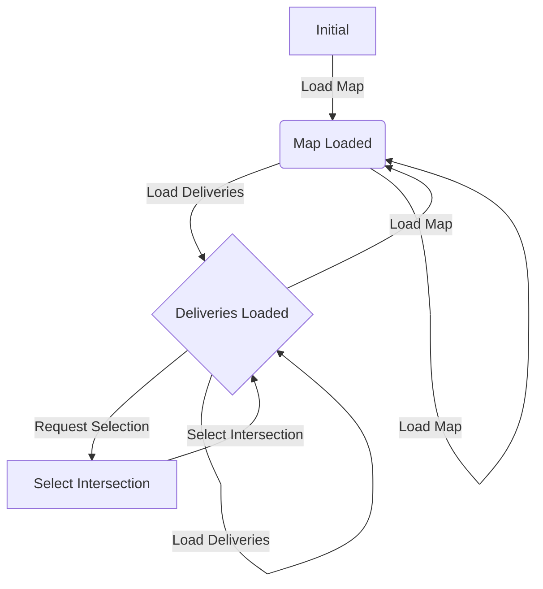

# GUI Architecture: State-Driven Command Factory

This document outlines the State-Driven Command Factory pattern used in the Delivrooom GUI. It's a combination of the **State** and **Command** design
patterns, providing robust state management and full undo/redo capabilities.

## Core Concepts

1. **`AppController` (Singleton)**: The central hub for all UI interactions. It exposes a limited public API to the UI (`requestX()`, `undo()`,
   `redo()`) and delegates command creation to the current state.

2. **`State` Interface (Command Factory)**: Each state represents a specific application context (e.g., `StateInitial`, `StateMapLoaded`). States act
   as factories, creating `Command` objects for valid operations within that context. If an operation is invalid, the state returns an error result
   instead of a command.

3. **`Command` Interface**: Encapsulates an operation with `execute()` and `undo()` methods. All actions that modify the application's data are
   implemented as commands (e.g., `CommandLoadMap`, `CommandAddDelivery`).

4. **`CommandManager`**: Manages two stacks (`undoStack`, `redoStack`) to track command history. It orchestrates the execution and reversal of
   commands.

## Architectural Flow

## State Transitions

The application moves through states based on user actions, ensuring operations are only available when appropriate.

## Key Benefits

- **Full Undo/Redo**: Every action is reversible.
- **Strong Encapsulation**: The UI is decoupled from business logic.
- **State Validation**: Prevents invalid operations and provides clear, contextual error messages.
- **Testability & Maintainability**: Components are self-contained and easy to manage.
